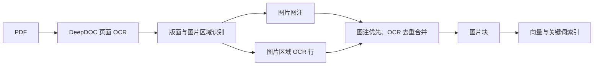

# PDF 论文图像 OCR 设计

## 目标

Paper 解析使用 DeepDOC 已有 OCR，将图片区域中的图号、图注、坐标轴标签、图例、单位和标注写入对应图片块，使这些信息可检索。图像语义理解与公式 LaTeX 转换不属于本阶段。

## 处理链路

DeepDOC 对页面执行 OCR 后，版面识别将属于图片区域的文字框标记为 `figure`。图片块按阅读顺序合并以下内容：

1. 有明确唯一图号的图注优先放在开头；
2. 同一图片区域的非空 OCR 行随后追加；
3. 以空白归一化、忽略大小写的方式去除重复行；
4. 图注出现多个不同图号时不猜测关联，但仍保留图片区域 OCR 行。

这样 `Fig. 2`、`Efficiency [%]`、`Frequency [GHz]`、图例和单位都能命中同一图片块，无需调用 Vision 模型。

## Paper 配置

| 字段 | 默认值 | 作用 |
| --- | --- | --- |
| `layout_recognize` | `DeepDOC` | 页面文字 OCR、版面、表格和图片区域识别。 |
| `chunk_token_num` | `550` | Paper 正文块目标大小。 |
| `overlapped_percent` | `0.10` | 正文块句子边界重叠。 |
| `table_context_size` | `1` | 表格补充相邻说明。 |
| `image_context_size` | `0` | 图片块默认不拼接无关正文。 |

Paper 不调用 Vision 模型。若未来增加图片语义理解，应作为独立的、可选的图片描述层，不能替换或丢弃 DeepDOC OCR。

## 公式边界

DeepDOC OCR 能保留公式附近的文字和页面位置，但不保证公式符号、上下标和二维结构可还原为 LaTeX。公式结构化识别留待后续单独接入 MinerU，并与图片 OCR 验收分开。

## 失败处理

- 图片区域无 OCR 文本：保留图片，图注存在时保留图注。
- 图注关联不唯一：不写入可能错误的图号图注，仍写入图片 OCR。
- OCR 错字或密集坐标：原样保留在图片块，验收时检查是否影响召回；需要降噪时再依据实际文献制定规则。
- 图片没有被版面识别为 `figure`：记录页码和区域，作为 DeepDOC 版面问题处理。
