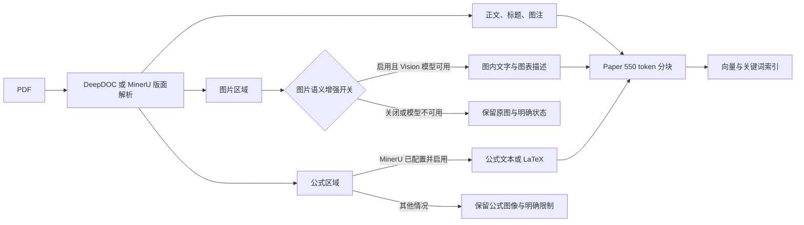

# PDF 论文图像与公式增强设计

## 目标

在保留现有 Paper 正文分块质量的前提下，让图内文字、图表语义和公式具备可检索性，并让每一步的降级原因可见。

## 当前问题

当前图片增强隐式读取租户默认 Vision 模型。模型未配置或调用异常时，图片保留但描述被跳过；用户无法从文档结果判断失败原因。DeepDOC 负责文字、布局和表格，不提供公式转 LaTeX 的专用能力。

## Paper V2 链路

## 配置契约

| 字段 | 默认值 | 作用 |
| --- | --- | --- |
| `image_vision_enable` | `true` | 是否调用默认 Vision 模型增强图片内容。 |
| `image_context_size` | `0` | 提供给图片描述和图片块的正文上下文窗口；不控制 Vision 是否启用。 |
| `layout_recognize` | `DeepDOC` | 默认正文、双栏和图表版面解析。 |
| `mineru_formula_enable` | `true` | 仅在选择 MinerU 后生效，控制公式识别。 |

前端 Paper 页面提供“图片语义增强”显式开关。公式识别不隐式切换解析器：用户必须选择已配置的 MinerU 模型，避免一键预设在模型缺失时把整份 PDF 解析改为失败。

## 失败策略

- 图片增强关闭：保留图片和图注，任务显示已按配置关闭。
- 未配置 Vision 模型：保留图片和图注，任务显示需要配置默认 Vision 模型。
- Vision 调用失败：保留图片和图注，任务显示模型错误，允许重新解析重试。
- 未选择 MinerU：DeepDOC 只保留公式的页面视觉信息，不承诺产生公式文本。
- MinerU 失败：解析任务应直接报告 MinerU 错误，不能伪装成公式已识别。

## 索引原则

图注、正文和图片内容分别保留。Vision 描述追加到图片块，不并入无关正文；`image_context_size` 只在用户选择时补充邻近正文。公式识别文本进入对应章节附近的块；识别失败时保留位置，避免 OCR 乱码成为高权重召回内容。

## 实施范围

本次实现完成显式图片开关、缺 Vision 模型的可见状态、Paper 默认配置与前端入口。MinerU 公式配置已由现有组件提供，本次在 Paper 页面明确其启用条件。后续可在文档详情页持久化图片/公式成功数与失败原因，形成可视审计报告。
