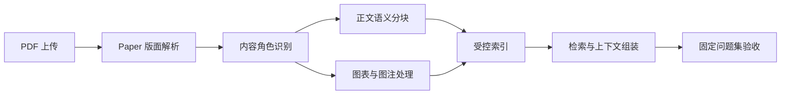

# PDF 论文处理方案

## 结论

技术论文 PDF 采用一条固定处理链路：**论文版面解析 → 内容角色识别 → 正文分块 → 图表关联 → 受控索引 → 问题集验收**。

核心原则是把正文、图注、表格、图片和版面噪声分开处理，再在有明确证据时建立关联。不能依赖扩大 token 上限或强行合并图片来掩盖版面解析问题。

## 适用对象

适用于单栏或双栏的期刊论文、会议论文、技术报告和学位论文 PDF，尤其包含图、表、公式、页眉页脚与扫描/OCR 内容的文献。

## 唯一处理链路

### 1. Paper 版面解析

使用 `Paper` 解析器保留标题、作者、摘要、章节、位置坐标和图表区域。正文按版面阅读顺序处理；图表区域不并入普通正文。

输入文献先标记以下风险：双栏、扫描件、图表密集、公式密集、跨页表格。双栏或图表密集文献必须进入人工抽查，不以解析成功状态作为质量结论。

### 2. 内容角色识别

每个解析单元按以下角色进入后续处理：

| 角色 | 内容 | 索引策略 |
| --- | --- | --- |
| `front_matter` | 标题、作者、单位、摘要 | 正常索引，保持完整可读。 |
| `body` | 引言、方法、结果、讨论、结论 | 作为主要检索对象。 |
| `caption` | Fig./Figure/Table 图注 | 正常索引，保留图号。 |
| `table` | 表格文本及标题 | 正常索引，保留 1 个邻近说明窗口。 |
| `figure` | 图片本体 | 保留位置与图号关联，不以图像 OCR 作为主检索文本。 |
| `figure_ocr_noise` | 坐标轴、图例、仪表与碎片 OCR | 保留以便溯源，降低检索权重。 |
| `boilerplate` | 页眉、页脚、版权、下载信息、页码 | 默认不参与向量检索。 |

角色识别应保留原始文本、页码和坐标。降权或过滤不删除原始资料，避免无法回溯。

### 3. 正文语义分块

正文以章节中的连续版面文本块为基本单位，按 token 上限合并，不能跨章节、跨无关图表或跨列强行拼接。

默认配置：

| 设置 | 默认值 |
| --- | --- |
| 解析器 | Paper |
| 正文块上限 | 550 token |
| 重叠 | 8% |
| 表格上下文 | 1 |
| 图片上下文 | 0 |
| 父子分块 | 关闭 |

目标是让每个正文块表达一个完整论述：至少保留对象、动作/方法、条件、参数或结论中的必要部分。正文块通常为 200–550 token；超过 600 token 必须是可解释的完整例外。

### 4. 图表与图注处理

图表不与邻近正文做猜测性合并。采用可解释的图号关联：

1. 从图注抽取 `Fig. n`、`Figure n`、`Table n`。
2. 从正文抽取相同图号的引用。
3. 同页时按图号和垂直位置关联图注、图片与正文引用。
4. 检索命中图注或图片时，补充关联的正文引用；命中正文图号引用时，可补充图注。

关联失败时保持独立块。不得因为相邻就把一段正文塞进图片块。

图内 OCR 满足以下任一条件时标记为 `figure_ocr_noise`：文字主要为数字、坐标轴单位、短标签、重复图例或仪表参数。该类块仍可在文档预览中查看，但不能高于相关正文和图注排序。

### 5. 父子分块：可选增强

父子分块不作为论文 PDF 的默认配置。只有正文检索已经正确、但回答经常缺少同段前提或结论时才开启。

启用后的规则：

| 层级 | 目标 |
| --- | --- |
| 母块 | 700–900 token，保持同一章节的连续上下文。 |
| 子块 | 180–350 token，以段落或紧密相关版面块为单位。 |
| 分隔 | 段落空行，不使用单个 OCR 换行。 |
| 建立条件 | 一个母块必须实际拆出至少 2 个子块。 |

一对一母子记录没有检索价值，必须直接保存为普通块。Paper 解析器在父子模式下应保留版面文本块的空行边界，供子块拆分使用。

### 6. 索引与检索

- `body`、`front_matter`、`caption` 和 `table` 正常参与文本与向量检索。
- `figure` 可按图号、图注和关联正文召回。
- `figure_ocr_noise` 与 `boilerplate` 降权或排除出默认召回。
- 返回结果时保留页码、位置、角色、图号和关联块标识，便于预览和人工核查。
- 父子模式下先用子块排序，再返回关联母块作为回答上下文。

## 代码收敛点

代码只围绕以下四个职责扩展，避免把规则散落到页面层：

| 模块 | 职责 | 产物 |
| --- | --- | --- |
| Paper 解析器 | 输出结构化版面块及位置 | 正文、图表、图注候选。 |
| 分块后处理 | 角色标记、噪声判断、图号提取与关联 | `chunk_role`、`quality_flags`、`figure_refs`、`related_chunk_ids`。 |
| 索引写入 | 保存原文、位置、关联与可检索状态 | 可审阅的索引记录。 |
| 检索排序 | 角色加权、图表关联回填、父子上下文回填 | 有效检索结果。 |

已完成的基础修正是：父子模式保留版面块边界；未真正拆分时不创建重复母块。后续优先实现角色标记和图号关联，再决定是否需要调整双栏阅读顺序。

## 质量门槛

处理结果满足全部门槛才作为默认方案推广：

1. 标题、作者、摘要、引言、方法、结果、结论都有完整可读块。
2. 抽查两个双栏页面，没有明显的左右栏交错句。
3. 至少 80% 抽查正文块在 200–550 token，或属于明确记录的完整例外。
4. 页眉、页脚、版权、图内 OCR 不作为主要检索结果。
5. `Fig. 2`、图表主题和正文引用可在前 3 条中找到正确图注或关联内容。
6. 目标、方法、参数、结果、结论五类问题中，至少四类的正确块进入前 3 条。
7. 父子模式开启时，不存在一对一重复母子记录。

## 实施顺序

1. 使用默认配置重新解析一篇代表性论文，完成正文基线验收。
2. 若图表问题不通过，增加角色标记和噪声降权。
3. 若仍无法稳定回答图表问题，增加同页图号关联。
4. 若正文检索正确但回答缺上下文，运行父子分块对照实验。
5. 只有多篇双栏论文都出现错序时，才修改底层阅读顺序算法。

每一步只改变一个变量，并使用同一组问题做前 3–5 条结果对比。

## 当前未通过项的根因与优化方式

### 图号关联缺失

**根因：** 当前索引只有 `doc_type_kwd`，没有保存图号、正文引用或图文关联 ID。图注、图片和 `Fig. n shows ...` 正文段即使在同页，也只能各自参与召回。

**优化：** 在 Paper 的分块后处理阶段提取标准化图号，例如 `fig:2` 与 `table:1`；将图注、图片和正文引用分别写入同一 `figure_refs` 字段，并在同页按垂直距离生成 `related_chunk_ids`。检索命中图注或图片时补充关联正文，命中正文图号引用时补充图注。

**约束：** 只关联图号相同且同页的块；跨页、多个图号或缺少图号时不猜测关联。

**验收：** 查询 `Fig. 2`、`Fig. 2 的电路结构`、`class-F PA schematic` 时，正确图注和相关正文至少有一项进入前 3 条。

### 图注不完整与 Table I 混入 Fig. 9

**根因：** 表格构造阶段将附近所有满足 `Fig.`、`Figure` 或 `Table` 模式的文字统一视为 caption 并拼接。一个跨栏表格附近的图号引用因此会进入表格标题。

**优化：** 将 caption 识别拆为 `figure_caption` 与 `table_caption`：表格只接收以 `Table n` 开头且与表格区域最近的图注；图片只接收以 `Fig./Figure n` 开头且与图片区域最近的图注。对同一区域出现多个不同图号的情况，保留原始位置但不写入可检索 caption。

**验收：** Table I 检索块不含 `Fig. 9`；每个可检索图片块只有一个明确图号，允许多行但不包含正文引用句。

### 双栏阅读顺序

**根因：** `_assign_column` 对页面中所有块的 `x0` 进行 KMeans，最多尝试 4 列。图、表、图注、跨栏标题和缩进正文都会形成额外聚类中心；当前论文因此被判为 4 列。随后这些列号参与正文合并，导致跨列文本混排。

**优化：** 列检测只使用候选正文块，排除 `figure`、`table`、caption、页眉页脚和跨栏标题；根据页面正文宽度与列间空白限制候选列数为 1 或 2。跨栏标题作为独立锚点，不参与列聚类。每页独立判断列数，不能由图表页影响整篇正文。

**验收：** 该论文的正文页判为 2 列；抽查两个页面，不出现左列末句与右列首句拼成同一块。

### 超过 600 token 的正文块

**根因：** `_merge_sections_by_pivot` 只控制多个版面块的合并；若单个 OCR/版面块本身已经超出上限，它会被原样保留。表格与摘要也不经过正文上限控制。

**优化：** 对单个超限的正文块按句子边界二次切分，并复制原块的位置元数据；优先在句末、段落空行和小标题后断开。表格和摘要保持独立，不以正文上限强拆，但需要在审阅中标为例外。

**验收：** 正文块中至少 80% 在 200–550 token；超过 600 token 的块必须是摘要、表格或有记录的不可切分段落。

### 块首缺少上下文

**根因：** 正文块按版面顺序合并，但内容未携带章节路径；当一个块从段落中间或图号引用开始时，检索结果缺少主题主语。

**优化：** 提取最近章节标题，生成非正文显示字段 `section_path`；在向量化文本前以短前缀加入标题，例如 `II. HIGH EFFICIENCY ...\n`。标题只加入一次，不计入父子内容重复。

**验收：** 抽查方法、结果与结论块，首句可独立理解；包含 `this method`、`these results` 等指代的块必须含章节标题或前置主语。

### 页眉、页脚与版权文本

**根因：** PDF OCR 将授权下载声明、页码、期刊页眉视为普通文本，Paper 分块没有在正文前过滤重复版面文本。

**优化：** 在页面级 OCR 结果上统计跨页重复文本，并结合位置过滤顶部/底部固定区域；再增加 IEEE 下载声明、页码、日期和期刊卷期的模式规则。过滤文本保存为 `boilerplate`，不参与索引。

**验收：** 以 `Authorized licensed use`、页码、期刊卷期等文本查询时，不应压过正文；正文块中不再含这类尾注。

### 真实检索验收尚未完成

**根因：** 当前核验以索引内容与块数为主，尚未执行统一问题集的前 3–5 条召回对比。

**优化：** 固定“目标、方法、参数、结果、结论、图表”六个问题，在每次解析后记录前 5 条块号、角色、页码和人工相关性。只有该表通过，才更新自检表的检索项。

**验收：** 六类问题至少五类在前 3 条中出现正确正文或图注；噪声、参考文献和页眉不进入前 3 条。

## 与现有文档的关系

- [论文 PDF 分块设计](论文PDF分块设计.md)：分块目标与参数依据。
- [分块自检表](分块自检表.md)：每次解析后的逐项验收。
- [当前文献分块审计](当前文献分块审计.md)：当前 PDF 的问题基线。
- [论文 PDF 分块优化方案](论文PDF分块优化方案.md)：阶段性方案与实验记录。

本文件是上述文档的总纲；发生冲突时，以本文件的默认处理链路和质量门槛为准。
