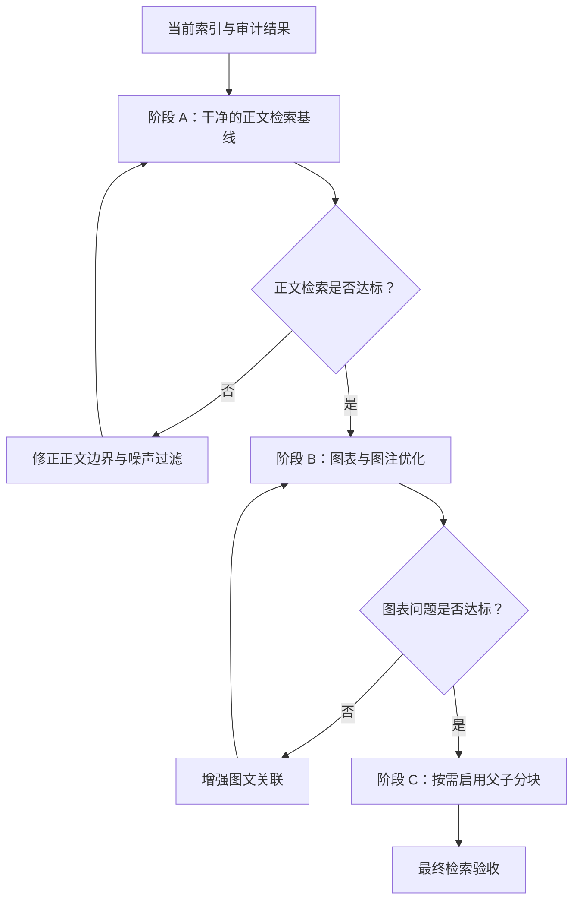

# 论文 PDF 分块优化方案

## 目的与边界

本方案解决当前文献审计中未通过的项目：无效父子块、块大小不均、图内 OCR 噪声、双栏图文混排和图文关联不足。

目标是提高“方法、参数、实验结果、结论、图号/图注”五类问题的前 3–5 条召回质量。块数不是目标；允许图表作为独立块，但不允许图内 OCR 压过正文和图注。

本文件只定义设计和验收步骤。任何配置变更、代码合并和重新解析都在评审确认后执行。

## 目标状态

| 维度 | 目标 |
| --- | --- |
| 正文块 | 一个紧密相关的论述单元，通常 200–550 token。 |
| 过长块 | 仅少数例外可超过 600 token，且必须保留完整方法或结果。 |
| 碎块 | 图内 OCR、坐标轴、页眉页脚不得作为主要正文检索结果。 |
| 图表 | 图号和图注必须可检索；图表可单独存在，但要能与其说明关联。 |
| 父子分块 | 只有一个母块对应两个或以上子块时才存母块。 |
| 检索 | 五类目标问题的相关正文或图注进入前 3–5 条。 |

## 方案总览

按风险从低到高分三阶段。每阶段都应使用同一份 PDF、同一组测试问题与上一个阶段对比；未通过时停止，不叠加下一阶段的改动。

## 阶段 A：建立干净的正文检索基线

### A1. 配置

| 设置 | 建议值 | 意图 |
| --- | --- | --- |
| 解析器 | Paper | 保留论文结构和位置信息。 |
| Chunk 上限 | 550 token | 避免一个块跨多个论述。 |
| 重叠 | 8% | 补足段落边界，不制造明显重复。 |
| 父子分块 | 关闭 | 先只观察独立检索块。 |
| 表格上下文 | 1 | 保留表格的近邻说明。 |
| 图片上下文 | 0 | 防止图内 OCR 扩散进正文。 |

### A2. 预期结果

- 块列表不再出现母块/子块的重复记录。
- 正文和图表噪声可分开审阅。
- 可以先回答以正文为主的“方法、参数、结果、结论”问题。

### A3. 决策门槛

以下四项全部满足，才进入阶段 B：

1. 标题、作者、摘要、引言、方法、结果、结论均能找到完整可读块。
2. 抽查两个双栏页面，不出现明显左右栏交错句。
3. 至少 80% 的抽查正文块处于 200–550 token 或属于可解释的完整例外。
4. 四个正文问题中至少三个的相关块进入前 3 条。

若失败，优先修改正文边界，而不是再次提高 token 上限。

## 阶段 B：图表和图注优化

### B1. 问题拆分

当前流程将版面模型识别为 `text/title` 的内容送入正文块，将图片/表格区域另行入库。图注有时属于正文路径，正文引用又属于另一个正文段，图内文字则在图片 OCR 路径。因此“Fig. 2 shows …”“Fig. 2. …”和图片本体没有稳定的共同标识。

### B2. 第一层：低风险过滤和标记

在图片块进入索引前增加质量标记，不删除原始资料。

| 规则 | 动作 | 理由 |
| --- | --- | --- |
| 文本主要由数字、坐标轴单位、短标签组成 | 标记为 `figure_ocr_noise`，降低检索权重 | 不让仪表文字压过正文。 |
| 文本以 `Fig.`、`Figure`、`Table` 开头 | 标记为 `caption`，保留图号 | 让图号查询优先匹配图注。 |
| 页眉、页脚、下载授权、页码 | 标记为 `boilerplate`，默认不参与向量检索 | 减少共同噪声。 |
| 正文中出现图号引用 | 提取 `figure_refs`，例如 `Fig. 2` | 为后续图文关联提供明确键。 |

建议在索引字段中保留 `content_with_weight` 原文，同时增加 `chunk_role`、`figure_refs` 和 `quality_flags`。检索阶段可以降低 `figure_ocr_noise` 与 `boilerplate` 的分数，而不破坏审阅与溯源。

### B3. 第二层：基于图号的图文关联

对同一页、同一图号执行可解释的关联，不依赖模型猜测。

1. 从图注块识别图号，如 `Fig. 2`。
2. 从正文块识别相同图号引用。
3. 在同页优先按垂直距离匹配图片区域与图注；图号一致时建立 `related_chunk_ids`。
4. 图表查询命中图注或图片时，将关联正文引用作为补充上下文；正文查询命中图号引用时，可选补充图注。

关联失败时保持独立块，不进行跨页或跨图号猜测性合并。

### B4. 决策门槛

查询 `Fig. 2`、`Fig. 2 的电路结构`、`class-F PA schematic` 时，前 3 条中至少包含正确图注；图内 OCR 块不应排在正确图注之前。

## 阶段 C：按需启用父子分块

### C1. 启用前提

只有阶段 A 的正文检索已达标、但回答经常缺少同段的前提或结论时才启用。短论文默认不需要父子分块。

### C2. 代码设计

已实现的两个基础修正：

1. Paper 合并相邻版面块时，在父子模式下保留空行边界，供子块分隔。
2. 未真正拆成多个子块时不创建母块，避免一对一重复。

启用父子分块后的目标结构如下：

| 层级 | 规模 | 内容 |
| --- | --- | --- |
| 母块 | 700–900 token | 一个章节内连续、可读的上下文。 |
| 子块 | 180–350 token | 一个段落或一个紧密相关的版面文本块。 |
| 图表块 | 独立 | 图注、表格、图片与受控的关联正文。 |

### C3. 验收规则

- 每个母块至少关联两个子块；一对一关联应为零。
- 子块命中后返回的母块不得跨越无关章节。
- 母子记录数增加必须能由真实的多子块关系解释。
- 关闭父子分块与开启父子分块分别跑同一组问题，后者只有在上下文完整性明显提升时才保留。

## 建议的代码改动顺序

| 顺序 | 改动 | 范围 | 风险 | 验证 |
| --- | --- | --- | --- | --- |
| 1 | 重新解析时应用阶段 A 配置 | 配置 | 低 | 块审阅和正文问题。 |
| 2 | 图块质量标记与检索降权 | 图片/表格后处理和检索排序 | 中 | 图号问题、噪声排名。 |
| 3 | 以图号建立图注、图片、正文引用关系 | PDF 版面后处理 | 中 | 同页图表问题。 |
| 4 | 父子分块对照实验 | Paper 分块和检索回填 | 中 | 母子比例、上下文完整度。 |
| 5 | 必要时改进双栏阅读顺序 | DeepDOC 版面/排序层 | 高 | 多篇双栏论文回归。 |

第 5 项不应为了单篇文献立即修改。只有多篇代表性论文都出现同类错序时，才把它提升为解析器级改动。

## 测试问题集

每次实验固定使用以下问题，记录前 5 条结果的块号、分数和人工判断。

| 类别 | 问题 |
| --- | --- |
| 目标 | 本文要解决什么功率放大器效率问题？ |
| 方法 | 文中如何构造 class-F Doherty amplifier？ |
| 参数 | 文中给出的输出阻抗和 offset line length 是多少？ |
| 结果 | WCDMA 条件下的 PAE 与 ACLR 结果是什么？ |
| 结论 | 作者最终得出的结论是什么？ |
| 图表 | Fig. 2 展示了什么？ |

## 结果记录格式

| 阶段 | 配置/代码版本 | 问题 | 前 3 条是否相关 | 噪声是否高于正文 | 结论 |
| --- | --- | --- | --- | --- | --- |
| A |  |  |  |  |  |
| B |  |  |  |  |  |
| C |  |  |  |  |  |
